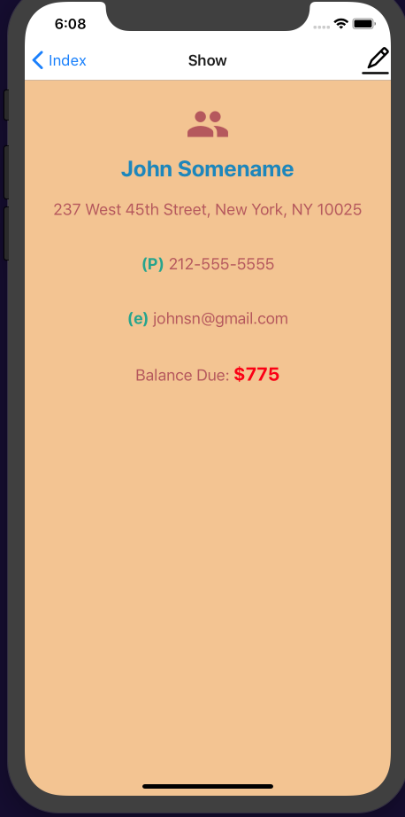
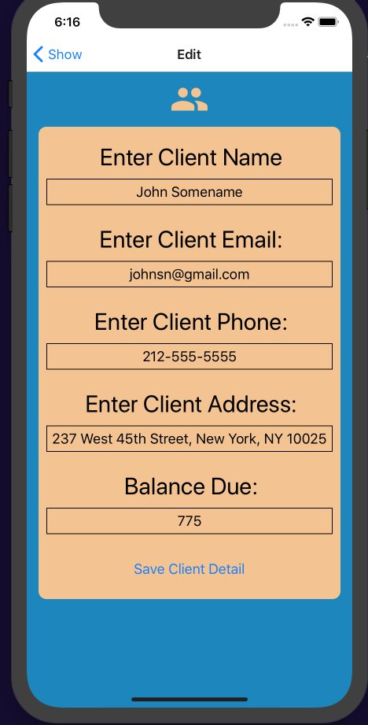
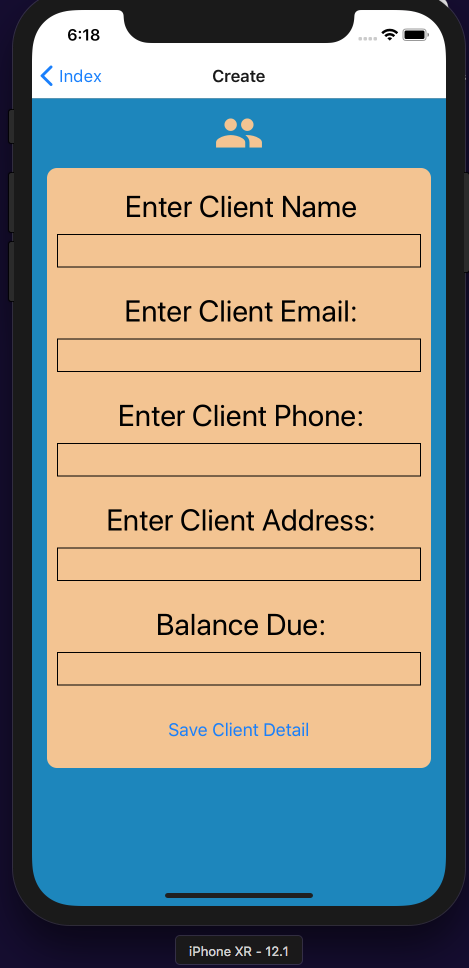

# **React-Native Client Roster CRUD App** (images below)

## **To View app on local computer *after* cloning project:**
___

## **STEP I.** -> cd into /client-roster folder
## 1) npm install in terminal
## 2) Start simulator on Mac.
## 3) npm start from project root.
## 4) On browser window that opens for EXPO click 'Run an iOS simulator' (or one of the other simulators) - if it does not work, on your computer with Simulator app in focus, choose from your computer dropdown: Hardware > Erase All Content & Settings, then repeat step 3 above.
## 5) If there's a preference to view on actual mobile device:
##    a) Install Expo from the App Store on your phone (free app).
##    b) Open your phone camera and scan the QR Code and click yes when asked on your phone if you'd like to open in EXPO.
___

## **STEP II.** -> cd into /jsonserver folder
### a) npm install
### b) open two terminal windows
### c) in first window run: *npm run db*
### d) in browser go to http://localhost:3000/clientdetails
### e) in second window run: *npm run tunnel*
NOTE: In second browser, go to the forwarding address shown in terminal. (This address expires in about 8-hours so you'd need to repeat from step c if you try to use this app after ~8-hours).
### f) inside client-roster folder/src/api/jsonServer.js -- change the http address to the forwarding address from the last step.
___

## ** NOTE: In Step I you may need to repeat #2 through #5

<h2 align="center">Views</h2>

  
  
  
  

   
